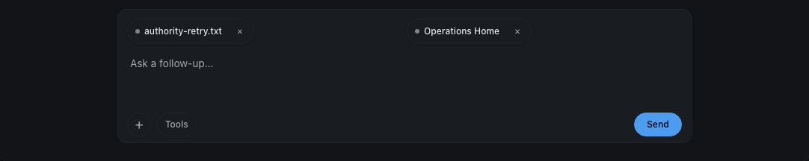
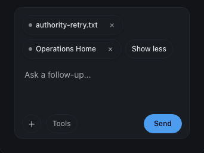
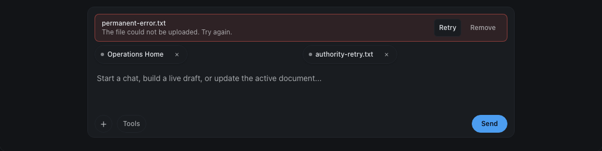
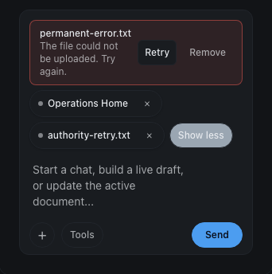
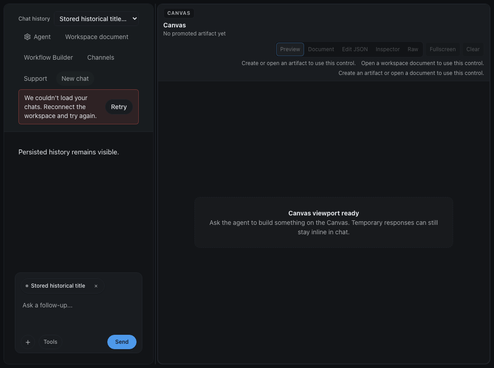
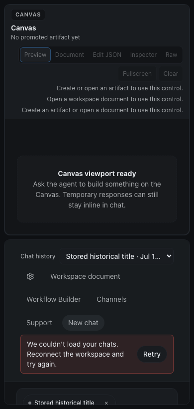
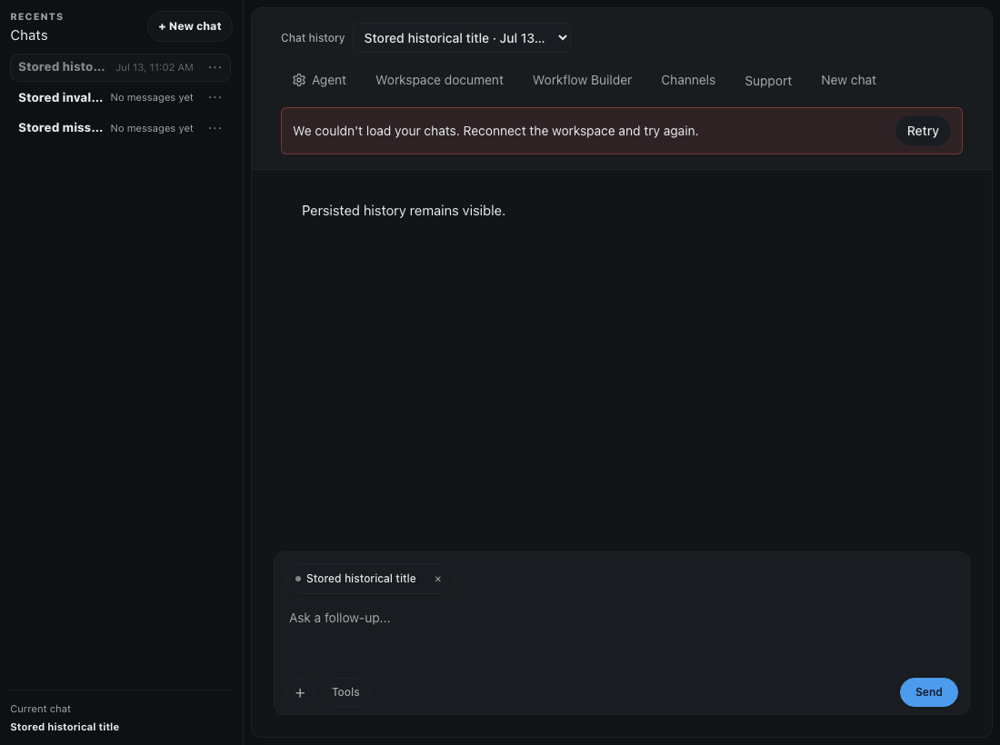
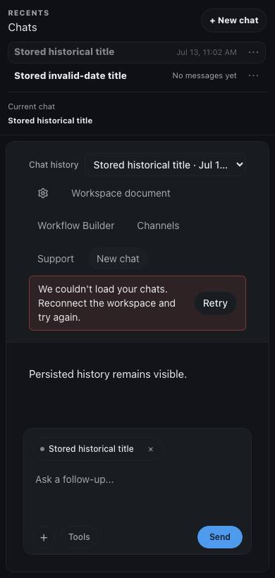

# Ultragoal UI evidence — 2026-07-14

These screenshots are local deterministic Playwright fixtures. They contain no production data and are not evidence of a production deployment.

| Goal | Viewport and scenario | Evidence |
| --- | --- | --- |
| G018 | 1100px composer after one-retry authority recovery; the uploaded file remains staged |  |
| G018 | 360px composer after one-retry authority recovery; the uploaded file remains staged |  |
| G018 | 1100px permanent upload refusal with sanitized copy and native Retry/Remove actions |  |
| G018 | 360px permanent upload refusal with sanitized copy and native Retry/Remove actions |  |
| G019 | 1100px canvas mode with hidden history rail; persisted history remains visible at the authority-recovery checkpoint |  |
| G019 | 390px canvas mode with hidden history rail; persisted history remains visible at the authority-recovery checkpoint |  |
| G019 | 1100px full workspace with expanded history rail; the selected chat is preserved and Retry is available |  |
| G019 | 390px full workspace with expanded history rail; the selected chat is preserved and Retry is available |  |

## Reproduction

- G018 source: [`tests/e2e/file-upload-authority-recovery.spec.ts`](../../../tests/e2e/file-upload-authority-recovery.spec.ts)
- G019 source: [`tests/e2e/embedded-session-history.spec.ts`](../../../tests/e2e/embedded-session-history.spec.ts)

```sh
pnpm exec playwright test -c tests/e2e/playwright.config.ts \
  tests/e2e/file-upload-authority-recovery.spec.ts \
  tests/e2e/embedded-session-history.spec.ts \
  --workers=1
```

Result: **7/7 tests passed** using local deterministic route and host-authority fixtures.
