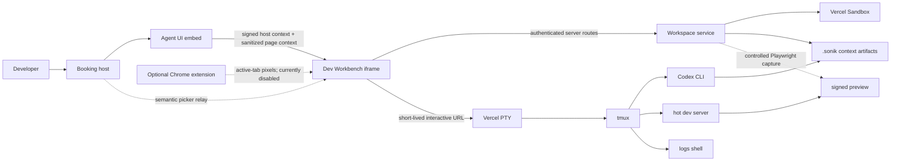
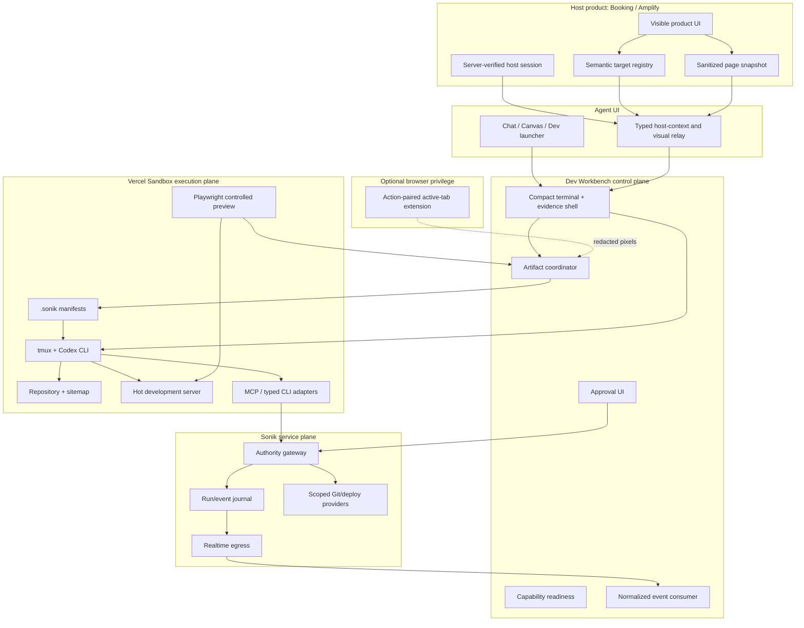
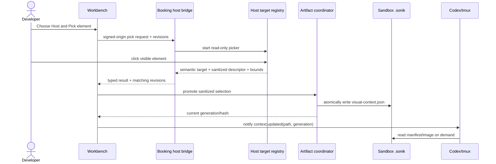
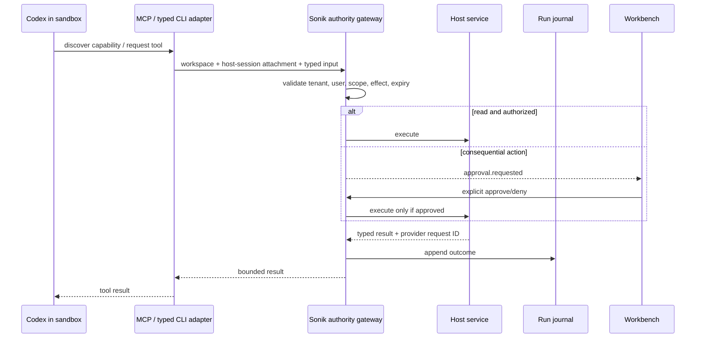

# Architecture

## 1. Existing system



### Existing ownership

- **Booking host:** user/session authority, current route, host DOM, semantic target registry, and host action adapter.
- **Agent UI embed:** product-neutral cross-origin bridge, layout/launcher integration, and bounded context transport.
- **Dev Workbench browser:** operator controls, terminal presentation, capability/status view, and explicit context requests.
- **Workbench server:** Basic Auth, workspace identity, sandbox provider calls, artifact coordination, and server-owned configuration.
- **Vercel Sandbox:** repository, filesystem, tmux, Codex CLI, development server, commands, and private `.sonik` artifacts.
- **Optional extension:** exact active-tab pixels only. It must not become target authority or a broad browsing agent.

## 2. Target system



## 3. Required seams

### 3.1 Workspace attachment

```ts
type WorkspaceAttachment = {
  workspaceId: string;
  provider: "vercel-sandbox";
  repository: { slug: string; revision: string; root: string };
  tmuxSession: string;
  preview: { status: "booting" | "ready" | "failed"; url?: string };
  contextPaths: {
    page: string;
    visual: string;
    hostAuthority: string;
    sitemap: string;
    commandCatalog: string;
  };
  resumableCursor?: string;
};
```

This is data, not a live SDK object. Provider clients are reconstructed on the server.

### 3.2 Capability readiness

Availability must be computed at runtime rather than inferred from catalog membership.

```ts
type CapabilityReadiness = {
  id: string;
  state: "ready" | "unavailable" | "expired" | "approval-required" | "degraded";
  reason?: string;
  source: "host" | "sandbox" | "provider" | "organization-policy";
  scopes: string[];
  checkedAt: string;
};
```

The same structure should drive buttons, Codex context, tool discovery, and diagnostics.

### 3.3 Normalized runtime events

Terminal bytes remain on the direct PTY connection. Product state uses bounded events:

```ts
type WorkbenchEvent = {
  id: string;
  workspaceId: string;
  sequence: number;
  at: string;
  kind:
    | "workspace.phase"
    | "process.output"
    | "file.changed"
    | "preview.status"
    | "network.failed"
    | "verification.result"
    | "context.updated"
    | "tool.started"
    | "tool.finished"
    | "approval.requested"
    | "deployment.status";
  correlationId?: string;
  payload: unknown; // kind-specific, bounded schema
};
```

Realtime egress transports these events and cursors; it does not proxy the terminal.

## 4. Page-context flow



### Rules

- Host owns DOM resolution and semantic identity.
- Public transport contains no raw selector, `outerHTML`, value, credential, or unrestricted text.
- A source/route revision change cancels pending work and invalidates the stable artifact.
- Codex receives a path and generation notification, not automatic image injection.

## 5. Screenshot providers

| Provider | Source | Fidelity | Trust boundary | Release state |
|---|---|---|---|---|
| Playwright | sandbox hot preview | `controlled-preview` | authenticated Workbench server + sandbox | Required P0 |
| Chrome extension | actual active host tab | `exact-active-tab` after declared redaction | explicit browser action + tab/origin/revision attestation | Optional P1; disabled until proven |
| Host iframe alone | embedding top-level tab | none | browser isolation prevents exact pixels | Must report unavailable |

Remote Playwright cannot truthfully reproduce transient cookie-backed host state. A DOM-to-image runtime is not approved for injection into every host.

## 6. Host authority and tools



The guest receives no reusable production bearer credential. MCP is a discoverability/execution protocol, not the authority boundary.

## 7. Deployment topology

| Component | Appropriate runtime | Reason |
|---|---|---|
| Booking/Amplify host | existing app/Worker deployment | Owns authenticated product state and host registry. |
| Agent UI embed | package/assets served by host or Agent UI deployment | Cross-product visual and host relay. |
| Workbench control plane | Vercel SvelteKit deployment | Authenticated routes and Vercel Sandbox provider integration. |
| Codex/repository/dev server | Vercel Sandbox | Full process/filesystem workload and isolation. |
| Terminal stream | direct Vercel interactive WebSocket | Avoids Worker/function byte proxy and latency. |
| Normalized run events | realtime-egress / Sonik service | Durable cursor, fan-out, and observability. |
| Tool/deploy authority | Sonik server gateway | Tenant, scope, approval, audit, and credential custody. |

A Cloudflare Worker may broker short API calls and authority, but it should not run the full Codex process, repository checkout, tmux, or hot server.

## 8. UI architecture

The embedded terminal needs a persistent compact shell, not the current binary choice between “full dashboard” and “terminal with every control hidden.”

Recommended regions:

1. **Compact command strip:** source, sync, pick, capture, layout, connection indicator, overflow.
2. **Terminal body:** full xterm surface with correct resize propagation.
3. **Collapsible evidence tray:** context, problems, changed files/diff, console, failed requests, verification, approvals.
4. **Progress overlay:** workspace bootstrap phases and recovery actions.

At narrow width, controls collapse into labeled menus but remain keyboard reachable. Fullscreen removes host chrome, not Workbench capability access.

## 9. Deliberate exclusions

- No second workflow engine alongside Sonik's run/event journal.
- No generic provider abstraction until a second provider proves the seam.
- No provider-specific raw event shapes in product UI.
- No global tool catalog represented as live availability.
- No background browsing or continuous screenshot recording.
- No separate chat/history backend for web, terminal, voice, or WhatsApp.
